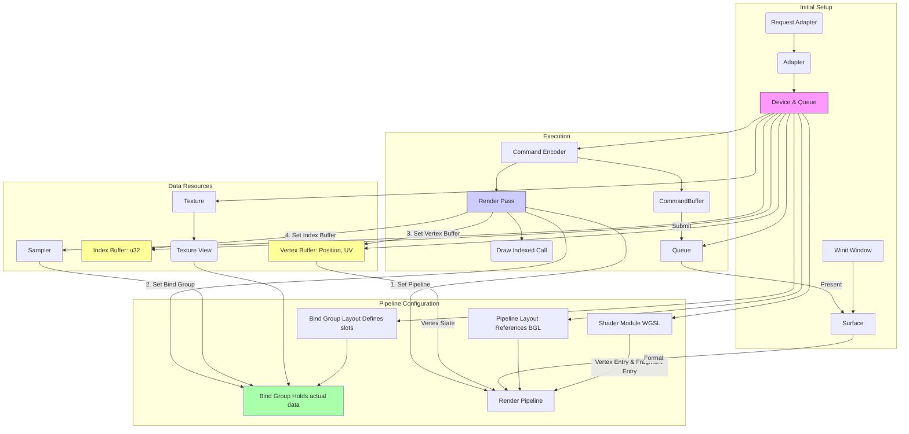

# Cobalt

```mermaid
graph TD
    subgraph Initial Setup
        A[Winit Window] --> B(Wgpu Surface);
        C(Request Adapter) --> D(Adapter);
        D --> E[Device & Queue];
    end

    subgraph Data Resources
        E --> V[Vertex Buffer: Position, UV];
        E --> I[Index Buffer: u32];
        E --> T[Texture];
        E --> S[Sampler];
        T --> TV(Texture View);
    end

    subgraph Pipeline Configuration
        E --> SM[Shader Module WGSL];
        E --> BGL[Bind Group Layout Defines slots];
        E --> PL[Pipeline Layout References BGL];

        BGL & TV & S --> BG[Bind Group Holds actual data];

        SM -- Vertex Entry & Fragment Entry --> RP[Render Pipeline];
        PL --> RP;
        B[Surface] -- Format --> RP;
        V -- Vertex State --> RP;
    end

    subgraph Execution
        E --> CE[Command Encoder];
        CE --> RPAS[Render Pass];

        RPAS -- 1. Set Pipeline --> RP;
        RPAS -- 2. Set Bind Group --> BG;
        RPAS -- 3. Set Vertex Buffer --> V;
        RPAS -- 4. Set Index Buffer --> I;

        RPAS --> DI(Draw Indexed Call);

        CE --> CB(CommandBuffer);
        E --> QU[Queue];
        CB -- Submit --> QU;
        QU -- Present --> B;
    end

    style E fill:#f9f,stroke:#333
    style RPAS fill:#ccf,stroke:#333
    style V fill:#ff9
    style I fill:#ff9
    style BG fill:#aaffaa

```